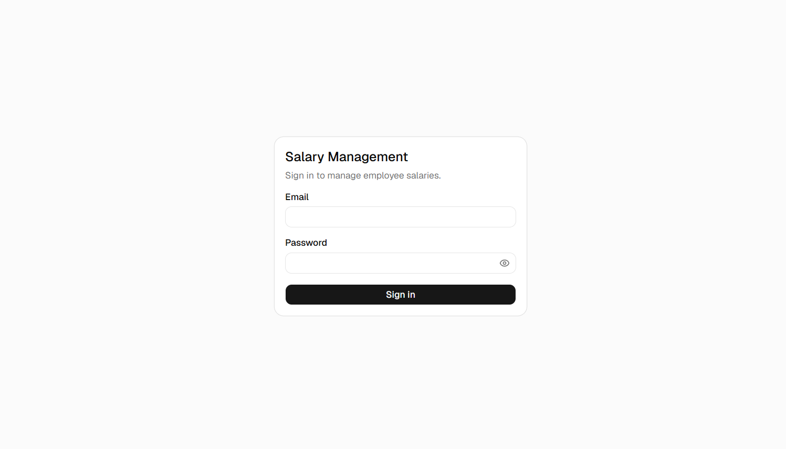
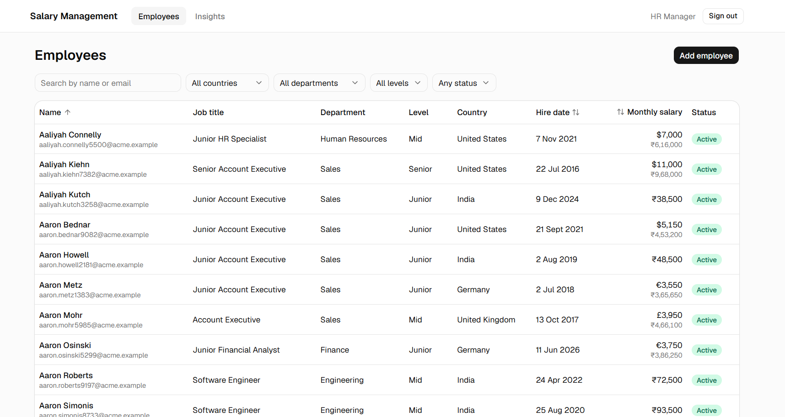
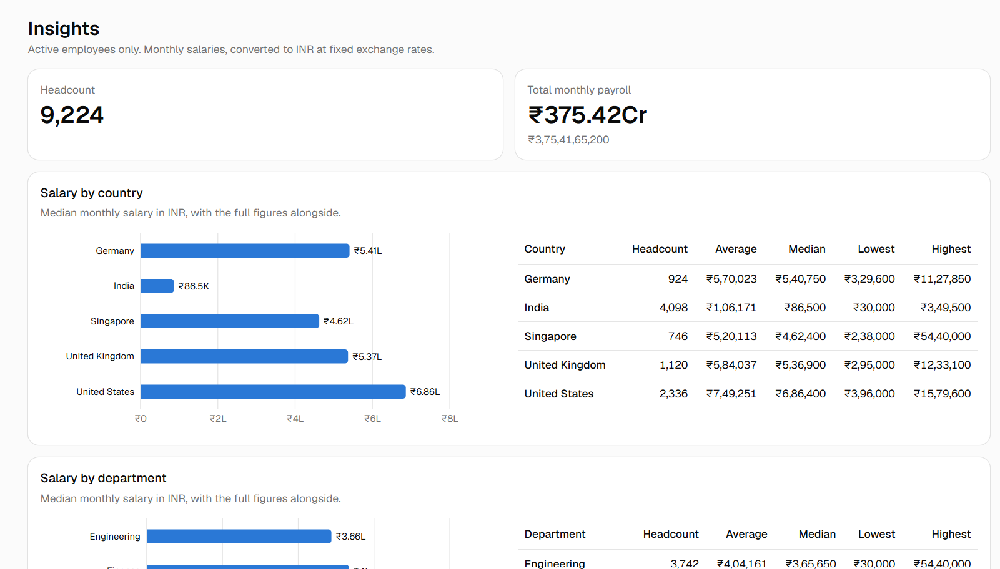
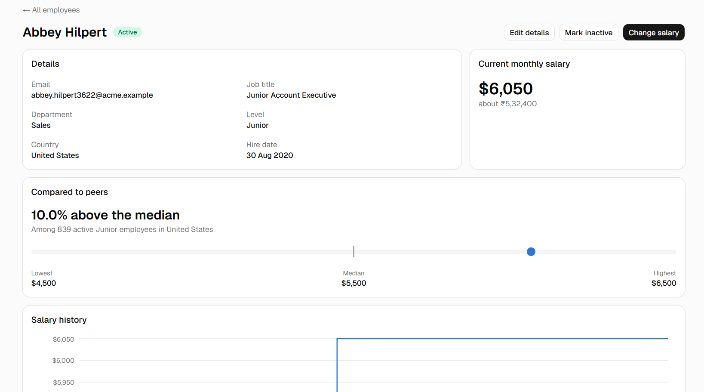

# Salary Management

A web application in which an HR Manager maintains salary data for 10,000 employees across five countries, and answers questions about how the organisation pays people. It replaces the spreadsheets the HR team used before.

**Live application:** https://incubyte-shubham.vercel.app

Sign-in details for the demo HR Manager account are shared with the submission. There is no public signup, because salary data is sensitive.

## What it does

- **Employees** — a list of all 10,000 records with search, filters (country, department, level, status), sorting and paging, all done in the database. The current view lives in the address bar, so it can be bookmarked.
- **Employee records** — view, add and edit an employee, and mark them inactive or active again.
- **Salary history** — a salary is never overwritten. Each change is a new dated record, so every employee shows their current salary and all earlier ones, as a chart and a table with the percentage of each change.
- **Compared to peers** — each employee's record shows where their salary sits against the median, lowest and highest among active employees in the same country and level.
- **Multiple currencies** — each salary is held and shown in the local currency of the employee's country (INR, USD, GBP, EUR, SGD), with its INR equivalent beside it.
- **Insights** — headcount, total monthly payroll, and average, median, minimum and maximum salary by country, department and level, as tables and charts in INR.

## Screenshots

**Sign in**



**Employees**



**Insights**



**Employee record**



## Documents

| Document | What it covers |
|---|---|
| [docs/REQUIREMENTS.md](docs/REQUIREMENTS.md) | Goal, scope and features, and what was deliberately left out and why. Written before any code. |
| [docs/ARCHITECTURE.md](docs/ARCHITECTURE.md) | System overview, data model, API, performance considerations and the testing approach. |
| [docs/DECISIONS.md](docs/DECISIONS.md) | Seventeen product and technical decisions, each with its reasoning and its cost. |
| [PROMPTS.md](PROMPTS.md) | The prompts given to the AI tool while building this. |

## Tech stack

| Area | Choice |
|---|---|
| Backend | Node.js, Express, PostgreSQL, TypeScript |
| Frontend | React, TypeScript, Vite, shadcn/ui on Tailwind CSS, Recharts |
| Tests | Vitest, Supertest, React Testing Library |
| Hosting | Vercel (React app and API in one project), Supabase (PostgreSQL) |

## Repository layout

```
/client        React app
/server        Express API, database migrations and the seed script
/api           Vercel serverless entry that hands /api requests to the Express app
/docs          requirements, architecture and decisions
```

## Running it locally

You need Node.js 22 or later and a PostgreSQL database. A free Supabase project works.

```bash
npm install

# Configure the API: copy the example and fill in the values it describes.
cp server/.env.example server/.env

# Create the tables, then load 10,000 employees, the HR Manager account and the exchange rates.
npm run migrate -w server
npm run seed -w server

# Start the API (port 3000) and the React app (port 5173) in two terminals.
npm run dev:server
npm run dev:client
```

Open http://localhost:5173 and sign in with the `SEED_HR_EMAIL` and `SEED_HR_PASSWORD` you set in `server/.env`.

The seed script is deterministic: running it again produces the same 10,000 employees.

## Tests

```bash
npm test                              # unit, API and UI tests; no database needed
npm run test:integration -w server    # the SQL itself, against a real PostgreSQL
npm run lint
npm run typecheck
```

`npm test` runs about 200 tests. They use in-memory fakes in place of the database, so they need no external service. The integration suite runs the real queries in a schema of its own, so it never touches development or production data.

## Deployment

The React app and the API are deployed as a single Vercel project and served from the same origin, as configured in [vercel.json](vercel.json). The project needs two environment variables:

| Variable | Value |
|---|---|
| `DATABASE_URL` | The PostgreSQL connection string. On Supabase, use the transaction pooler string. |
| `JWT_SECRET` | A random string of at least 32 characters, used to sign the session cookie. |
