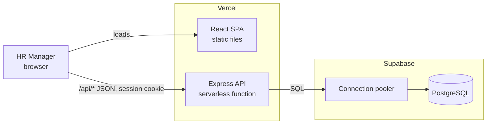
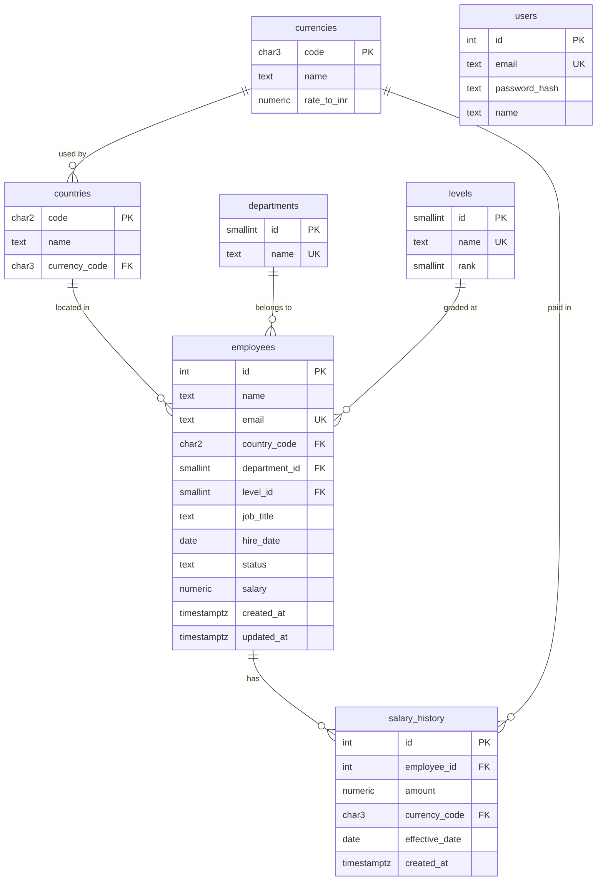

# Architecture and Design

**Status:** Approved · **Date:** 2026-10-05

This document turns [REQUIREMENTS.md](REQUIREMENTS.md) into a design: how the system is put together, what the data looks like, and what the API exposes. The reasoning behind the choices is in [DECISIONS.md](DECISIONS.md).

## System overview



- The React app and the Express API are deployed as one Vercel project and served from the same origin. The browser calls the API under `/api`.
- The API is stateless. It connects to Supabase PostgreSQL through Supabase's connection pooler, because serverless functions open many short-lived connections.
- Locally, the same Express app runs as an ordinary Node server and the React app runs on the Vite dev server, proxying `/api` to it. Local development also uses a Supabase database, so no local PostgreSQL is needed.

## Repository layout

```
/client        React + TypeScript app (Vite)
  src/
    api/           typed API client
    components/ui  shadcn/ui components
    features/      auth, employees, insights
    pages/
/server        Express + TypeScript API
  src/
    app.ts         builds the Express app (no listen, so tests and Vercel can import it)
    bootstrap.ts   wires the app to the real database from environment variables
    index.ts       starts the server locally
    config/        environment parsing
    db/            connection pool, migrations
    middleware/    auth, validation, error handling
    modules/       auth, employees, salaries, insights, meta
    seed/          seed script and data generators
/api           Vercel serverless entry that hands /api requests to the Express app
/docs          requirements, architecture, decisions
vercel.json    Vercel build settings and routing
PROMPTS.md     log of AI prompts
```

Each backend module has the same three layers:

| Layer | Responsibility | Knows about |
|---|---|---|
| Routes | Parse and validate the request, call a service, shape the response | HTTP |
| Service | Business rules (for example, what makes a salary change valid) | Neither HTTP nor SQL |
| Repository | SQL queries | PostgreSQL |

Services receive their repository as a parameter, so the business rules can be unit-tested with an in-memory fake and no database.

## Data model



**Reference data** (loaded by the seed script)

| Table | Values |
|---|---|
| Countries and currencies | India (INR), United States (USD), United Kingdom (GBP), Germany (EUR), Singapore (SGD) |
| Departments | Engineering, Sales, Marketing, Finance, Human Resources |
| Levels | Junior, Mid, Senior, Manager |

**Rules the schema enforces**

- Money is `NUMERIC(14,2)`; exchange rates are `NUMERIC(12,6)`. No floating point.
- `employees.salary > 0`, `salary_history.amount > 0`, `currencies.rate_to_inr > 0`.
- `employees.status` is either `active` or `inactive`.
- Employee email is unique regardless of letter case.
- One salary record per employee per effective date.
- Row level security is enabled on every table with no policies. The API connects as the table owner and is unaffected; every other role, including those behind Supabase's auto-generated REST API, is shut out.

**Current salary and history**

- `employees.salary` holds the current monthly salary in the local currency of the employee's country.
- An employee's country cannot be changed after creation, so all of an employee's salary records share one currency.
- `salary_history` holds every salary the employee has had, including the current one. Each row keeps its own currency code, so old amounts stay correct.
- Adding an employee writes the employee row and the first history row (effective on the hire date) in one transaction.
- Changing a salary writes a new history row and updates `employees.salary` in one transaction. History rows are never updated or deleted.
- A change's effective date must not be in the future and must be later than the employee's latest existing record. The current salary is therefore always the latest record.

**Indexes**

- `employees`: one each on `country_code`, `department_id`, `level_id` and `status` for the list filters; unique on `lower(email)`.
- `salary_history`: unique on `(employee_id, effective_date)`, which also serves the history lookup.

## API

All routes are under `/api`, exchange JSON, and require a signed-in session except `POST /auth/login`.

| Method | Path | Purpose |
|---|---|---|
| POST | `/auth/login` | Check email and password, set the session cookie |
| POST | `/auth/logout` | Clear the session cookie |
| GET | `/auth/me` | Return the signed-in user, or 401 |
| GET | `/meta` | Countries (with currency), departments and levels, for filters and forms |
| GET | `/employees` | Paginated list with search, filters and sorting |
| POST | `/employees` | Add an employee with a starting salary |
| GET | `/employees/:id` | One employee |
| PATCH | `/employees/:id` | Edit details or status (not salary or country) |
| GET | `/employees/:id/salary-history` | Salary records, newest first |
| POST | `/employees/:id/salary` | Record a salary change: `{ amount, effectiveDate }` |
| GET | `/insights/summary` | Headcount and total monthly payroll in INR, active employees only |
| GET | `/insights/salary-stats?groupBy=` | Average, median, min and max monthly salary in INR for active employees, grouped by `country`, `department` or `level` |

**`GET /employees` query parameters**

| Parameter | Meaning |
|---|---|
| `search` | Matches part of the name or email, ignoring case |
| `country`, `department`, `level`, `status` | Exact-match filters |
| `sort` | One of `name`, `hireDate`, `salary`; anything else is rejected |
| `order` | `asc` or `desc` |
| `page`, `pageSize` | Page number from 1; page size capped at 100 |

The response carries the rows plus the total count, so the UI can show page numbers.

**Conventions**

- Request bodies and query strings are validated with Zod before reaching a service. Invalid input returns 400 with field-level messages.
- Errors share one shape: `{ error: { code, message, details? } }`.
- Money is sent as a string (`"1850000.00"`), never a JSON number, so no precision is lost in transit.
- Each employee in a response carries the salary in local currency, the currency code, and the INR equivalent.

## Authentication

- The seed script creates one HR Manager user. The password is stored as a bcrypt hash.
- A successful login sets a signed JWT in an `HttpOnly`, `Secure`, `SameSite=Strict` cookie that expires after 8 hours.
- A middleware verifies the cookie on every other route and returns 401 if it is missing, invalid or expired.
- The React app checks `/auth/me` on load and redirects to the login page on 401.

## Screens

| Screen | Contents |
|---|---|
| Login | Email and password form |
| Employees | Table with search box, filters, sortable columns and pagination; "Add employee" button |
| Employee detail | Details, current salary, salary history table; actions to edit, change salary and mark inactive |
| Insights | Headcount and total monthly payroll tiles; salary statistics by country, department and level as a chart and a table |

## Seed script

- Generates 10,000 employees with Faker using a fixed random seed, so every run produces the same data.
- Monthly salaries are drawn from a range that depends on country and level, in local currency. Each employee gets between one and three salary history records.
- Rows are inserted in batches of 1,000 inside one transaction.
- The script clears the tables first, so it can be re-run safely.
- The HR Manager's email and password are read from environment variables.

## Performance considerations

| Concern | Approach |
|---|---|
| Listing 10,000 employees | Filtering, sorting and pagination happen in SQL; the browser only ever receives one page. |
| Search | A case-insensitive substring match on name and email. At 10,000 rows this is a scan of a few milliseconds, so no text-search index is added. |
| Sorting by salary across currencies | Sorted by the INR equivalent, computed in SQL by joining the rate. |
| Insights | Each statistic is one `GROUP BY` query using `percentile_cont` for the median. Aggregating 10,000 rows takes milliseconds, so results are computed on request and not cached or precomputed. |
| Serverless connections | A small connection pool per function instance, connected through Supabase's pooler. |
| Seeding | Batched multi-row inserts, not 10,000 single statements. |
| UI responsiveness | The search box is debounced, and fetched pages are cached client-side. |

## Testing approach

| Level | What it covers | Database |
|---|---|---|
| Unit — services | Business rules: salary change validation, employee creation, status changes | None (in-memory fake repository) |
| Unit — pure functions | List query builder (filters, sort whitelist, paging), Zod schemas, seed generators, money formatting | None |
| API | Routing, validation errors, auth middleware, response shapes, using Supertest | None (fake repositories) |
| UI | Login form, employee table interactions, salary change form, using React Testing Library | None (mocked API) |
| Integration | The SQL itself: filters, the salary-change transaction, median and other aggregates | Real PostgreSQL |

The first four levels run with `npm test`, need no external service and finish in seconds. The integration suite runs with a separate command against a dedicated Supabase test database, kept apart from the development and production data.

## Libraries

| Area | Library |
|---|---|
| Backend | `express`, `pg`, `zod`, `bcryptjs`, `jsonwebtoken`, `cookie-parser`, `node-pg-migrate`, `@faker-js/faker` |
| Frontend | `react`, `vite`, `tailwindcss`, shadcn/ui, `recharts`, `react-router`, `@tanstack/react-query`, `react-hook-form` |
| Testing | `vitest`, `supertest`, `@testing-library/react` |
| Tooling | `typescript`, `eslint`, `prettier` |
